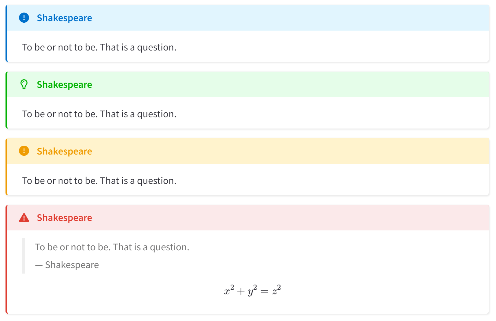
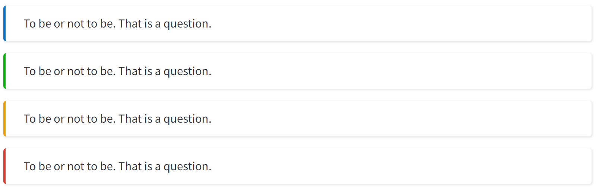
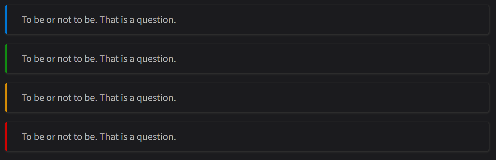
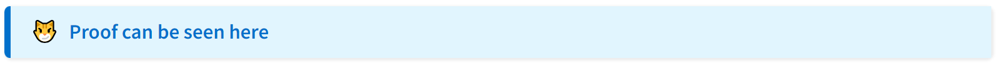
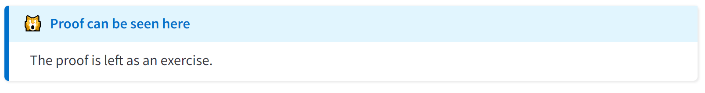

# Theory of Everything | [Huanyu Shi's Blog](https://huanyushi.github.io/) 

This site is made with [Jekyll](https://jekyllrb.com/) using the beautiful [Chirpy](https://github.com/cotes2020/jekyll-theme-chirpy/) theme. Thanks to the contributors for their work.

## Customization
Based on Chipy, I've made lots of customization, and I have blogged about these changes. You can see [Chirpy Blog Customization](https://huanyushi.github.io/posts/Chirpy-Blog-Customization/) to get more details (Note that it was written in Chinese).

What I have done:
- Modify the MathJax config file to load the physics package.
- Add a background image to the sidebar and modify the associated text styles.
- Add friend links in the sidebar (see this [discussion](https://github.com/cotes2020/jekyll-theme-chirpy/discussions/1677)).
- <del>Make Further Reading display the latest posts (see this [PR](https://github.com/cotes2020/jekyll-theme-chirpy/pull/1699)).</del> (This PR has been merged after Chirpy v6.5.5)
- Add site statistics from 'buanzi'([不蒜子](https://busuanzi.ibruce.info/)) in the footer.
- Add background animation (refer to [@NichtsHsu](https://nihil.cc/)).
- Add GitHub contribution graph (via [gh-contrib-graph](https://github.com/lengthylyova/gh-contrib-graph)).

- Add 4 new prompts (see this [discussion](https://github.com/cotes2020/jekyll-theme-chirpy/discussions/1707)).

<table>
<tr>
   <th>Light</th>
   <th>Dark</th>
</tr>
<tr>
<td></td>
<td></td>
</tr>
<tr>
<td></td>
<td></td>
</tr>
</table>

- Modified the style of the `details` element.

<table>
    <tr>
        <th>Close</th>
        <td></td>
    </tr>
    <tr>
        <th>Open</th>
        <td></td>
    </tr>
</table>

- Python implementation for LQIP (Low Quality Image Placeholders) (see this [discussion](https://github.com/cotes2020/jekyll-theme-chirpy/discussions/1685)).
- Python implementation for Inverted image.

## Introduction
Here, I share study notes and ideas related to my research journey. While updates may be irregular, feel free to drop by anytime to explore. Your visit is appreciated!

Some study notes include:

- [Quantum Many-Particle Theory](https://huanyushi.github.io/categories/quantum-many-particle-theory/)
- [Python Study Notes](https://huanyushi.github.io/categories/python/)
- ...

PDFs:
- [Summaries of Zhihu Answers](https://huanyushi.github.io/posts/Mathematics-For-Zhihu/)
- [LaTeX Lab Report Template](https://huanyushi.github.io/posts/LabReport-Template/)
- [TikZ Examples](https://huanyushi.github.io/posts/Tikz-Example-Contour-Integration/)
- ...

## License

This work is published under [MIT](LICENSE) License.